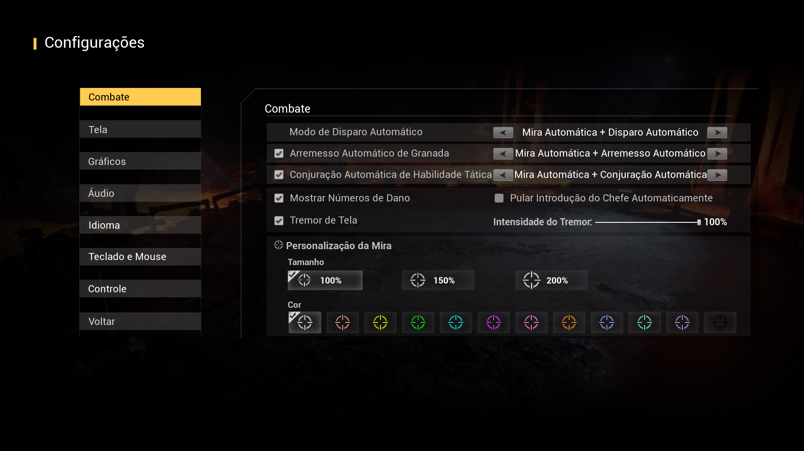
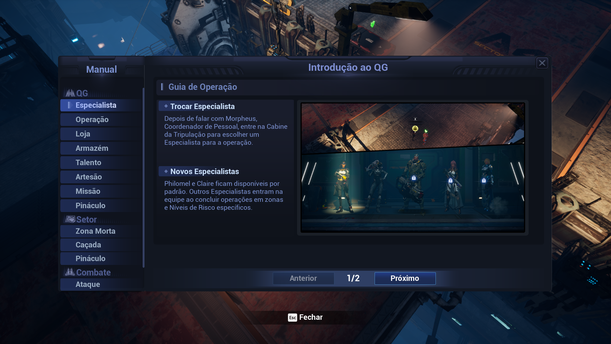
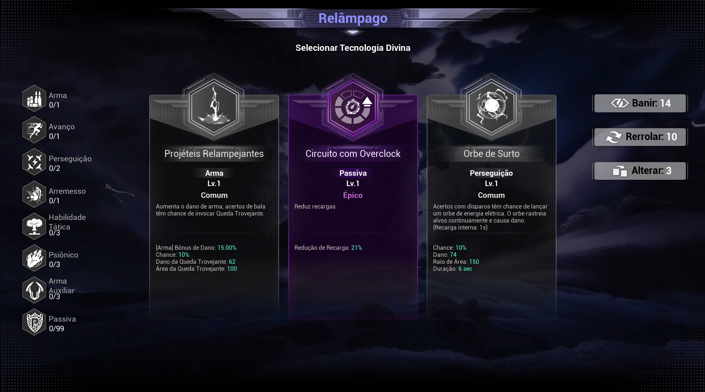

# Reincarnation Insurance Program

## Brazilian Portuguese Localization Project

Community-maintained Brazilian Portuguese localization for **Reincarnation Insurance Program**.


**🇺🇸 English Documentation**

- [English documentation home](Docs/EN/README.md)
- [Localization proposal](Docs/EN/Localization_Proposal.md)
- [Translation notes](Docs/EN/Translation_Notes.md)
- [Glossary](Docs/EN/Glossary.md)
- [Known issues](Docs/EN/Known_Issues.md)

**🇧🇷 Documentação em Português**

- [Início da documentação](Docs/PT/README.md)
- [Proposta de localização](Docs/PT/Proposta_Localizacao.md)
- [Notas da tradução](Docs/PT/Notas_da_Traducao.md)
- [Glossário](Docs/PT/Glossario.md)
- [Problemas conhecidos](Docs/PT/Problemas_Conhecidos.md)

---

## About

This repository is the central community hub for the Brazilian Portuguese localization of **Reincarnation Insurance Program**.

It is intended for:

- Brazilian players who want to play the game in Portuguese;
- community members who want to report issues or suggest improvements;
- contributors who want to help maintain the localization;
- WarmCore Studio and 2P Games, if they wish to evaluate the project for possible official integration.

The project is maintained by GitHub user **vigarizta**.

## Why This Project Exists

**Reincarnation Insurance Program** is in Early Access and may continue receiving updates, new text, UI changes, and balance adjustments. This repository keeps the Brazilian Portuguese localization organized, reviewable, and ready to evolve with future versions of the game.

The goal is not only to provide a translation, but to maintain a professional localization project with clear documentation, issue reporting, version tracking, and community feedback.

## Current Status

- ✅ Complete localization
- ✅ Gameplay tested
- ✅ Manual terminology review
- ✅ UI reviewed
- ✅ Multiple QA passes
- ✅ Community maintained
- ✅ Standalone patch
- ✅ Final validation: **3680 / 3680 entries, 0 errors, 0 warnings**

Current localization version: **v1.0.4**

## Features

- Full Brazilian Portuguese localization source.
- Standalone optional `.pak` patch for testing and community use.
- Reviewed terminology and glossary.
- Documentation in English and Portuguese.
- Screenshots of the localization running in-game.
- GitHub Issues workflow for community reports.
- Templates for translation issues and feature requests.

## Installation

1. Download the latest package from [Releases](https://github.com/vigarizta/Reincarnation-Insurance-Program-PTBR/releases).
2. Open the `Optional_Patch` folder.
3. Copy `RIP_PTBR_P.pak` to the game's `AKA_RIP/Content/Paks` folder.
4. Start the game.

The patch is standalone and does not overwrite original game files. To remove it, delete only `RIP_PTBR_P.pak`.

## Downloads

### ⭐ Easy Installation (Recommended)

Download **RIP_PTBR_Installer.exe**.

Simply run the installer and follow the instructions.

> Windows SmartScreen or antivirus software may display a warning because the installer is not digitally signed. This is normal for community-created software. The installer only automates the installation of the localization.

### 🇧🇷 Instalação Fácil (Recomendado)

Baixe **RIP_PTBR_Installer.exe**.

Basta executar o instalador e seguir as instruções.

> O Windows SmartScreen ou o antivírus podem exibir um aviso porque o instalador não possui assinatura digital. Isso é normal em softwares criados pela comunidade. O instalador apenas automatiza a instalação da localização.

---

### ⚙️ Manual Installation

Download **RIP_PTBR_P.pak**.

Copy the file into:

```text
AKA_RIP/Content/Paks/
```

### 🇧🇷 Instalação Manual

Baixe **RIP_PTBR_P.pak**.

Copie o arquivo para:

```text
AKA_RIP/Content/Paks/
```

---

### 📄 Documentation

Download **RIP_PTBR_Localization_v1.0.zip**.

Contains documentation, localization sources and project information.

### 🇧🇷 Documentação

Baixe **RIP_PTBR_Localization_v1.0.zip**.

Contém documentação, arquivos-fonte da localização e informações do projeto.

If you find any issue, please collaborate with us so we can keep improving the localization.

Se encontrar algum erro, colabore para melhorarmos a localização.

## Documentation

English:

- [Documentation home](Docs/EN/README.md)
- [Localization proposal](Docs/EN/Localization_Proposal.md)
- [Translation notes](Docs/EN/Translation_Notes.md)
- [Glossary](Docs/EN/Glossary.md)
- [Known issues](Docs/EN/Known_Issues.md)

Português:

- [Início da documentação](Docs/PT/README.md)
- [Proposta de localização](Docs/PT/Proposta_Localizacao.md)
- [Notas da tradução](Docs/PT/Notas_da_Traducao.md)
- [Glossário](Docs/PT/Glossario.md)
- [Problemas conhecidos](Docs/PT/Problemas_Conhecidos.md)

Project files:

- [Roadmap](ROADMAP.md)
- [Version information](VERSION.md)
- [Contributing guide](CONTRIBUTING.md)
- [Code of conduct](CODE_OF_CONDUCT.md)
- [Changelog](CHANGELOG.md)

## Screenshots

### Main Menu


### Settings



### Inventory / Equipment


### Tutorial



### Talent Tree


### Divine Technology



## Compatibility

| Game Version | Localization Version | Status |
| --- | --- | --- |
| Early Access | v1.0.4 | Current community release |
| Future game updates | TBD | To be reviewed when new text or UI changes are released |

## Roadmap

See [ROADMAP.md](ROADMAP.md).

## Releases

Latest release:

- [Brazilian Portuguese Localization v1.0](https://github.com/vigarizta/Reincarnation-Insurance-Program-PTBR/releases/tag/v1.0)

Future release notes should include both English and Portuguese sections.

## Report Translation Issues

Any player can help improve the localization.

If you find untranslated text, English strings, UI overflow, text clipping, line break issues, terminology inconsistencies, or formatting problems, please open a GitHub Issue:

https://github.com/vigarizta/Reincarnation-Insurance-Program-PTBR/issues

Please include:

- a screenshot;
- where it occurred;
- the current text;
- a suggested correction, if you have one.

Please do not use e-mail or external contact channels. All reports should go through GitHub Issues.

## Community Contributions

Community help is welcome. You can:

- report untranslated or incorrect text;
- suggest more natural PT-BR phrasing;
- report interface overflow or clipped text;
- point out terminology inconsistencies;
- review glossary decisions;
- suggest improvements for future updates.

See [CONTRIBUTING.md](CONTRIBUTING.md).

## Project Structure

```text
.
├── .github/
│   └── ISSUE_TEMPLATE/
│       ├── feature_request.md
│       └── translation_issue.md
├── Docs/
│   ├── EN/
│   │   ├── README.md
│   │   ├── Localization_Proposal.md
│   │   ├── Translation_Notes.md
│   │   ├── Glossary.md
│   │   └── Known_Issues.md
│   └── PT/
│       ├── README.md
│       ├── Proposta_Localizacao.md
│       ├── Notas_da_Traducao.md
│       ├── Glossario.md
│       └── Problemas_Conhecidos.md
├── Localization_Source/
│   ├── CSV/
│   └── Glossary/
├── Optional_Patch/
├── Screenshots/
├── CHANGELOG.md
├── CODE_OF_CONDUCT.md
├── CONTRIBUTING.md
├── LICENSE.txt
├── ROADMAP.md
├── VERSION.md
└── README.md
```

## License

See [LICENSE.txt](LICENSE.txt).

All rights to **Reincarnation Insurance Program** belong to their respective owners. This project is a free community localization contribution and does not claim ownership of the game, its assets, or its original text.

## Acknowledgements

Thanks to WarmCore Studio and 2P Games for creating and publishing **Reincarnation Insurance Program**.

Thanks to the Brazilian players and community members who report issues, test updates, and help improve the localization.
